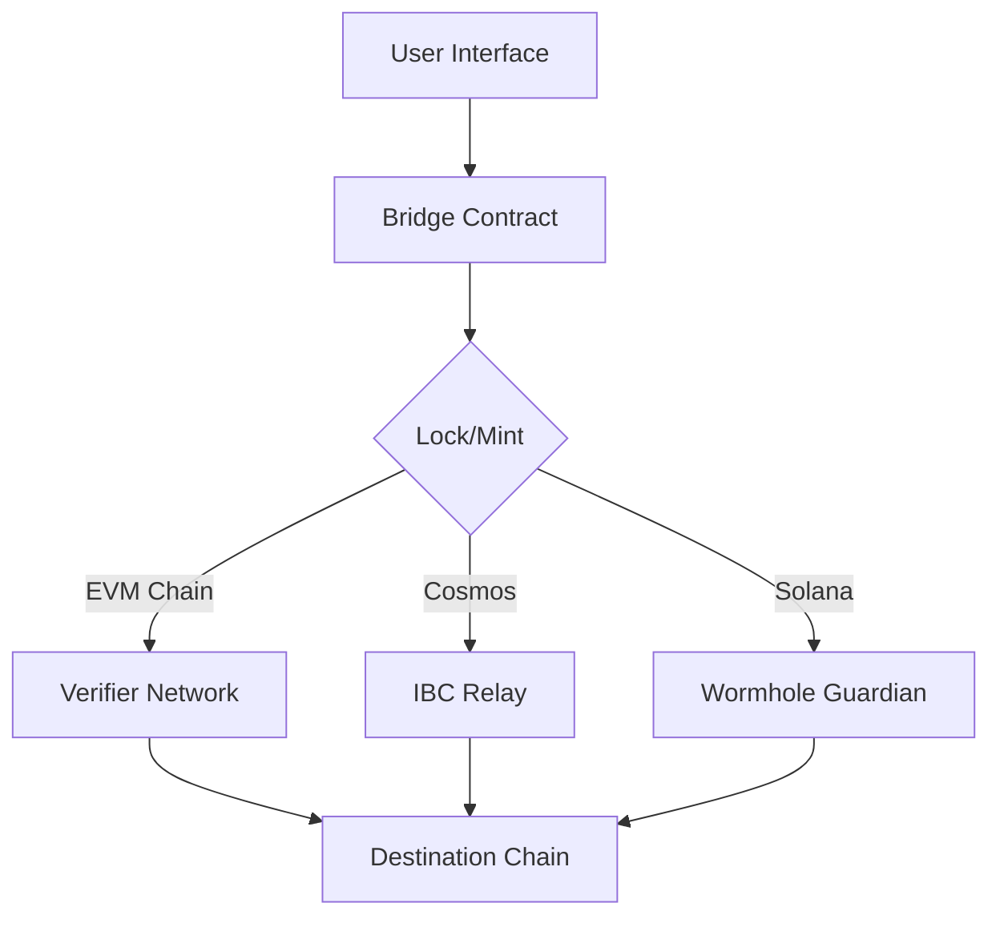

# QuantumBridge - Cross-Chain Interoperability Protocol


A next-generation cross-chain asset bridge enabling secure, instant transfers between EVM, Cosmos, and Solana chains. Built with Next.js 14 and TypeScript.

## Features ✨

- **Zero-Knowledge Security** 🔒  
  Military-grade security using zk-SNARKs and MPC protocols
- **Multi-Chain Support** ⛓️  
  Seamless transfers between 25+ blockchains
- **Instant Settlement** ⚡  
  Sub-second finality with optimistic verification
- **Enterprise Dashboard** 📊  
  Real-time network analytics and transaction monitoring
- **Developer API** 💻  
  RESTful API for integration with dApps and services
- **Proof Verification** 🔍  
  On-chain verification of cross-chain transactions

## Tech Stack 🛠️

**Frontend**
- Next.js 14 (App Router)
- TypeScript
- Tailwind CSS + Framer Motion
- React Icons
- Vercel Analytics

**Security**
- Zero-Knowledge Proofs (zk-SNARKs)
- Multi-Party Computation (MPC)
- Threshold Signature Scheme (TSS)

**Infrastructure**
- Chainlink CCIP
- LayerZero Protocol
- Axelar Network
- Wormhole Bridge

## Architecture Overview 🏗️



## Getting Started 🚀

### Prerequisites
- Node.js 18+
- npm 9+
- MetaMask/Phantom Wallet

### Installation
```bash
git clone https://github.com/yourusername/quantumbridge.git
cd quantumbridge
npm install
```

### Environment Setup
Create `.env.local` file:
```env
NEXT_PUBLIC_INFURA_ID=your_infura_id
NEXT_PUBLIC_ALCHEMY_KEY=your_alchemy_key
NEXT_PUBLIC_WALLETCONNECT_ID=your_project_id
```

### Running Locally
```bash
npm run dev
```
Open [http://localhost:3000](http://localhost:3000) in your browser.

## Key Components 🔑

1. **Core Bridge Contract**  
   `contracts/Bridge.sol` - Handles asset locking/minting
2. **Proof Generator**  
   `libs/proof-generator` - zk-SNARK circuit implementation
3. **Relayer Service**  
   `services/relayer` - Off-chain message relayer
4. **API Endpoints**  
   `app/api/` - REST API for bridge operations

## Deployment 🚢

### Vercel
[](https://vercel.com/new/clone?repository-url=https%3A%2F%2Fgithub.com%2Fyourusername%2Fquantumbridge)

### Docker
```bash
docker build -t quantumbridge .
docker run -p 3000:3000 quantumbridge
```

## Security 🔐

All contracts have been audited by [CertiK](https://www.certik.com).  
Read our [Security Policy](SECURITY.md) for vulnerability reporting.

## Contributing 🤝

We welcome contributions! Please read our [Contribution Guidelines](CONTRIBUTING.md).

## License 📄

Apache 2.0 - See [LICENSE](LICENSE) for details

## Contact 📬

- Discord: [quantumbridge.chat](https://discord.gg/your-invite)
- Twitter: [@QuantumBridge](https://twitter.com/QuantumBridge)
- Email: [support@quantumbridge.xyz](mailto:support@quantumbridge.xyz)
